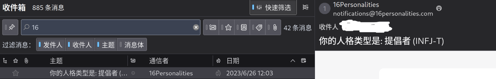

# 周记 #2 - 破除“社恐”属性

https://www.youtube.com/watch?v=4jARV_XYfdk

在现实中，我是属于不太喜欢与人交流的类型。而在两三个月前我复测了自己的mbti，发现自己内倾属性依然很高，验证了这个判断。

然而作为一个游走在充满英鱼的河里的科寄狐，“说”成为了提升专业水平的重要一环（语言学习四大样，听说读写），所以在入学的时候我就打算尽力改变现状——单就这个月来说我至少参加了两次团体的面试，努力地去接触一些友善的人。

上周末去参加院学生会的面试，但是因为自己的疏忽自己并没有交报名表上去，但是抱着说不定也行的想法，冒着淅淅沥沥的小雨还是去了面试现场，在现场和学姐打好了招呼，心惊胆战地等待着（因为临时起意，稿子什么的都没有准备）。不过好在面试的过程是顺利的，信技部的学长学姐没有过度为难我。就在我写上次的周记的时候，我成功地被录用了。（但是也有可能是面试这个部门的人实在太少了的原因...）

说实话，面试过程我还是比较紧张的，因为第一次在那么多人面前接受面试官（实在不知道怎么说，就先这么说吧）的盘问（解释一下，面试是在一个大会议室里，前几排是面试官，后面是在等的面试的人），但是面试过后心中有一种一块大石头落地的释然。

我还记得这周三综合英语课上，老师在引导我们发言时说的话，大概意思是说“社恐”和害羞之间还是有区别的，一种是不愿意主动和别人说话，但是一旦发言就能说个没完，另一种是真的不愿意说话，少言寡语。
（但我实在忘记了两者之间的对应的关系，而且我在写这个东西的时候状态很差，屋漏偏逢连夜雨，Bing又打不开，所以只能先放着。）

这句话对我的启发很大。后来想到，“社恐”这个词本身就是一种被人为定义的类型，有句老话说的好，规矩是死的，但人可以是活的（叠甲：没有教唆违法的不良导向），也就是说，人是可以通过做一些事来跳脱出这个框架来的。
我更加释然了，感觉一切更明朗了起来。

哦，读到现在了，你是不是想问另一次面试是什么情况？虽然这件事不属于这一周的范畴，但是想到万一有人好奇我就简单提两句：
学校里有个教务处直管的“以升大学生创新创业中心”（通俗点说就是科创中心+一堆相关社团，但是零基础版本），开放日集体参观前，我心想可得到一个接触科技的好机会，所以在他讲~~传教~~的时候我光速填了他们的报名表，之后就是一段比较漫长的等待，报名过后还有面试，面试之后还有复试，不过复试和我无关了，因为我面试根本没过（哭）

因为是第一周开始上课，所以课业压力并不是很大，除了综合英语和这语音两门课需要真切的发言外，剩下的完全可以当个小透明，对我暂时来说真的很友好（

当然为了解决自己的这个问题，自己还“为3D打印机多花5块钱”（[来源](https://o3o.ca/@grassblock/111061509864724847)）加入了创客空间的一个协会，也去了那么四五次，但是吧在自打这周研讨会之前我是没太想到这花出去的钱有什么意义，直到我临回家前的那个晚上的研讨会上晚走了亿会儿白嫖到了下面这两样东西：

我就觉得这钱花得值了。

当然他们那个协会的气氛还是比较和谐友善（核心价值观？）的，~~至少在晚上是这样~~
我依稀记得当时的一度尴尬的场面——当时除了在搞分享会这个东西外，还有免费体验激光雕刻的一个流程，成品可以拿走（就大概是上面那样子），但是吧，我几乎待在那里一晚上，根本没两个人来，当那个建模部的学姐在群里问还有没有人来的时候，我在群里放鱼钩说没报名的可以来吗，当然最后还是因为拍了现场的照片的原因被发现了，之后交谈的场面可以说是一度极为尴尬，不过之后便放开了（这归功于那句“不用那么拘谨”），甚至因为打开figma的展示自己的设计稿等等的操作而被夸赞“比我懂得多”（但我觉得更多是因为我用Linux...），后来就是看流程啦，顺手带了一份上次活动的nfc小灯（

这周还有个什么未来科技产业大会，但是与我关系不大，表演又像军训汇演一样不大好看（除了后排看不到边的无人机表演），就不写了。

好了终于来到了最后一部分（仰头），这周虽然很忙，也没学到太多东西，~~但是又算平稳地过了一周~~。怎么说呢，尽管我们一直在给人贴标签，并可能以此作为评判他人的标准。“社恐”其实也是划分群体的“标签”之一，但是不能受此制约而不去突破。
mbti测试更多地也是在给自己贴标签，在茫茫人海中寻找那些“同是天涯沦落人”的感觉，至于它的可靠程度，这完全看在自己。
最后想引用在[大型纪录片之《INFJ-T 4W5传奇》](https://www.bilibili.com/video/BV1TV4y1a7XE/)中的一条评论：
> _世界是错误的，因为它始终在通往正确的道路上。
在你真正接受真实的自己之后，别人才可能接受真实的你。_

小声：本来想用Vercel那个og image playground来写封面的，结果因为图片跨域问题弄不好，就暂时还是用figma设计封面了...
以及封面背景是自己在临回家的最后一天在学校拍的，不过谁问我了

