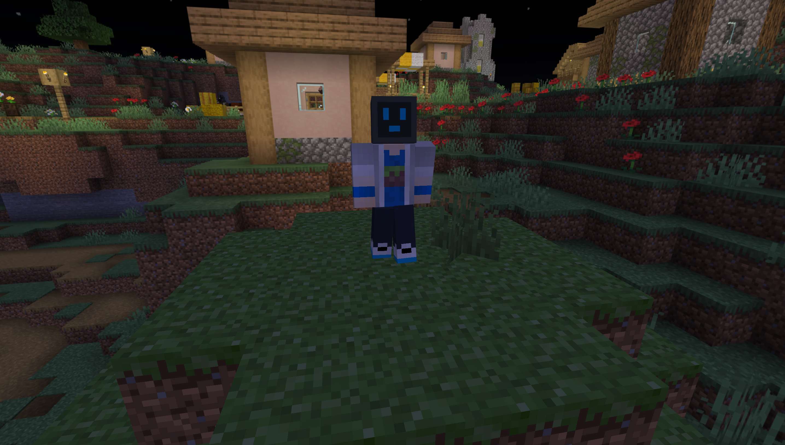

# 杂谈 - 大数据、生活方式和一些改变

https://music.163.com/#/album?id=178429151

想起来好久没写/分享自己随机的想法了...事实上n周没写周记，我也有很多想说的事情，且让我慢慢说。

来了大学也有两个月了，别的先不说，我这作息是越来越不正常了...最晚达成了12:40还在水群的纪录，最早也就11点睡，早上6点40的闹钟不一定能叫醒我，关掉后迷迷糊糊再醒来发现已经7点半已是日常。虽然各位可能已经见怪不怪，但是对于之前坚守晚上十点休息的我来说，还是属于睡眠不足的，因而导致了我每天的精神状态并不好，像什么突然发疯以及抑郁都是常态。我一度怀疑过自己是不是患上了躁郁症，再一想我不应该把这么严重的疾病安在自己身上，很快否决了这个判断。
> 八上政治：要做情绪的主人
> 
> 我：被情绪操控成赛博疯子

说到赛博疯子，最近把一直想要翻新的Minecraft皮肤翻新了一下，虽然只是简单地换了个脑袋，准备走异形头的路线（拜托异形头真的很酷的好吧）。还想绘制几套新衣服...

---（这上面是1号写的，正好愁怎么开头，找到这个几近废案的东西就从这里开始写）---

这两天发现自己不知道因为什么原因发烧了...（明明穿的暖暖和和的）再加上体测每一项都不合格给我带来的十分低落的心情，我去找了一个不经常专门联系的朋友去问，令我惊讶的是，这个平时几乎只讨论科技相关内容、~~甚至喜好于自删消息~~的朋友居然真的给我了比较详尽的建议（老实来讲我真的怀疑这位是做什么工作的），正好今天病也好的差不多了，我决定慢慢地实践起来。（虽然我觉得我还是会管不住自己的嘴就是了）

周末的时候趁着能够清晰思考问题的时候打开了blockbench把皮肤也不算从上到下的翻新完了，但是基本达成了目的。但是想用 novaskin wallpaper 做渲染图的时候发现它炸了许久了，只能自己学学怎么做...然后我匮乏的知识和能力连比较入门的 mine-imator 都弄不明白（我在Arch上连装都装不上、用都用不了啊），中文教程也少...

其中一个形象（我直接在blockbench截图的）：

其余的时候就只是躺在不大不小的床上刷b站然后对着沙雕视频呵呵傻乐，然后一刷刷很久...（如果没人找我聊天的话）后来就看几个虚拟主播，真正把自己缠进去了，还好正事不多...处理起来也不麻烦。

就在今天，阴差阳错地刷到了两次这个[《算法已经作恶到这地步了？》](https://www.bilibili.com/video/BV16u4y187Fd/)，抱着疑惑打开了这个在很久之前看过的视频（说实话没有太多印象），同时翻着评论，看到像“热门并不是真正的热门”“b站也是这样”等等的话，我不由得害怕了起来，关掉了视频。

如果你出于某些原因不能观看视频，以下是一份总结：

> 在互联网时代,大数据已经渗透到了我们生活的方方面面,甚至影响到了我们看到的评论内容。算法会根据个人的喜好不断推送同质化的内容,为我们量身打造一个专属的小世界,看你想看的,听你想听的,让人们越陷越深,无法自拔。同时,大数据也存在着许多问题,如信息茧房、诱导消费、杀熟等。我们需要保持头脑清醒,警惕被数据分析操控的命运。

就大数据这件事，已经是老生常谈的一个问题了，不管是怎么说，观点就已经放在那里，要说还是老一套，“杀熟”“信息茧房”，说起来也没意思，而且大多都是散播自己的观点然后拍屁股走人，只留下一地狼藉，完全没告诉大家 “我要怎么做？”，而且更戏剧性的是，我是在大数据的推荐下看到这样的视频的。这下好了，由于暂时性的无所事事，只能又去刷视频。

大数据已经与各行各业结合地紧密结合已经有许多年了，想逃脱几无可能（除非你真的说只用Matrix、mastodon这些去中心化理念极重，几乎谈不上大数据这种），而且只因为这些害处而对优点不管不顾，从而放弃使用相关的服务，也是不明智的。但是具体怎么做，我却说不太上来，只能说点“有效利用大数据”“提升自己”这样的空话（因为我自己仍深受其害）。

以及周末的时候把连带着在虚拟机里用用了半年的 gnome 又换回到了 kde plasma ，*[发现世界变得如此地清晰](https://nya.one/notes/9lyw58vgskjw0rm7)*，现在保留着 gnome 相关的东西试用，等我观察一番再正式迁移。

顺便一提，在朋友的帮助（以及Google搜索）下解决了 Linux 查看以及解压 zip 压缩包时奇奇怪怪的中文编码问题，好哦！（彻底抛弃 7-zip on wine（确信

好像也没什么要说的了，最近的精神状态也不好，写文章也前言不搭后语，这个也是断断续续写出来的。

最近由于转发不加查证、夹杂过分主观观点的消息主动暂停了telegram上的更新，也不太敢写什么东西，真的担心哪里说的不严谨、胡乱引用怕大家误会，同时也算是为了不让自己想太多，周报也暂停了。或许我真的需要疏导一下自己的心理了。

以后可能还是会以这种杂谈的方式说说最近的状况，时间跨度差不多也是一周，所以大概也算周报，但是更新频率也不高。年终总结在考虑新的形式，挑一个精神状态好的时候写，年底前能写出来。

我站流量极少，估计也没人注意到这个身体和精神状态都不好的人吧。最后，谢谢你有耐心地读到这里，欢迎给我提相关的建议，我真的很需要这些。

